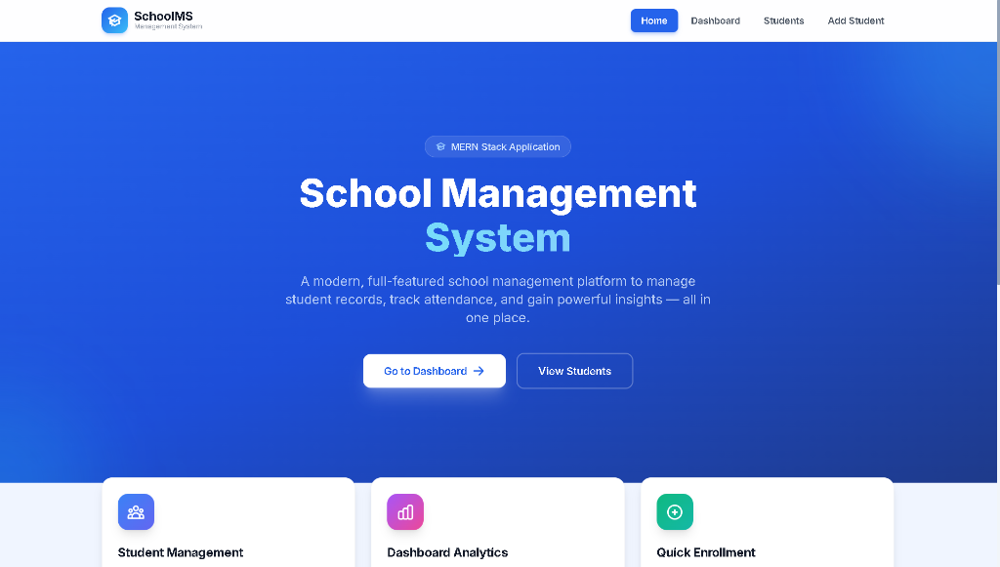
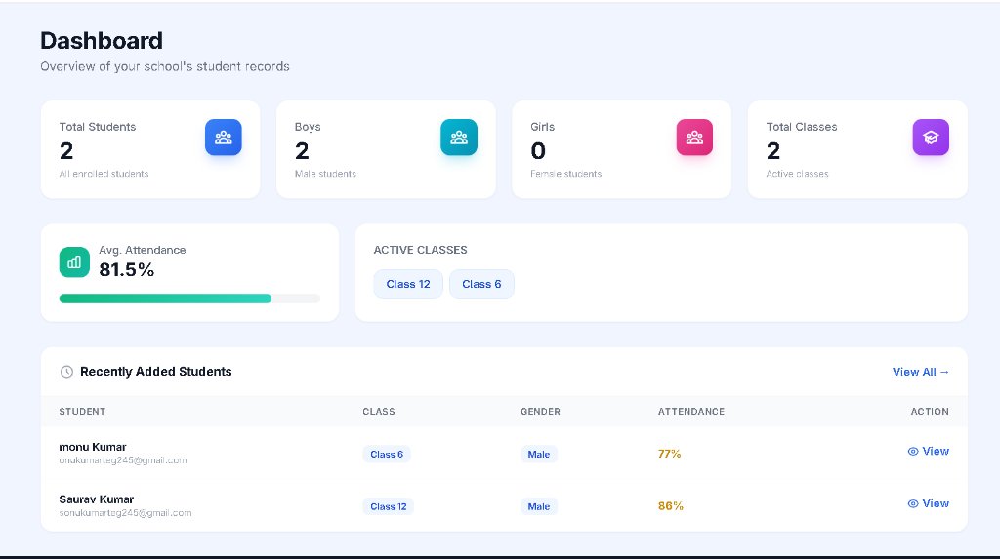
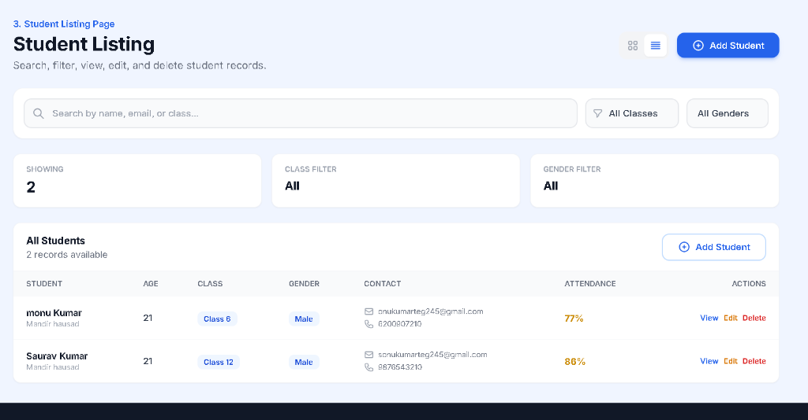
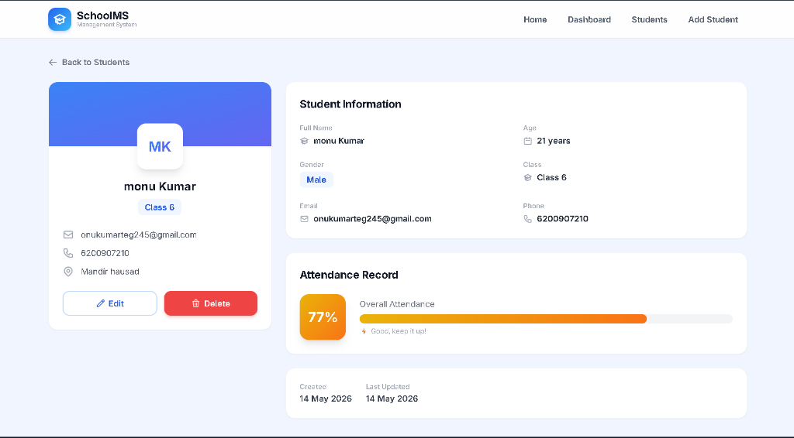
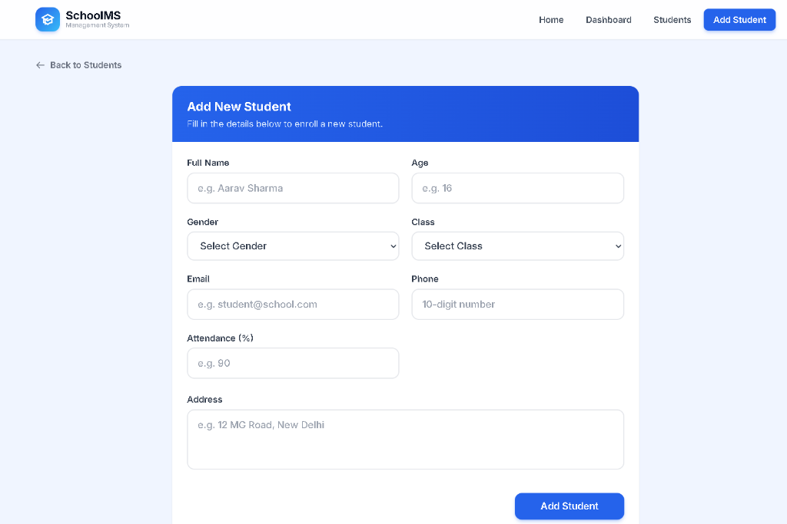

#  School Management System

A modern, full-featured **MERN Stack** (MongoDB, Express.js, React.js, Node.js) web application for managing school student records with a professional, responsive UI.


---

###  [Live Demo - Frontend](https://candiclie-assign.vercel.app/) | [API Endpoint - Backend](https://candiclie-assign.onrender.com/api)

---

##  Features

- **Full CRUD Operations** — Add, view, edit, and delete students
- **Dashboard Analytics** — Stats for total students, boys/girls count, classes, avg attendance
- **Search & Filter** — Search by name/email/class, filter by class and gender
- **Responsive Design** — Mobile-first UI that works on all devices
- **Modern UI/UX** — Built with Tailwind CSS, glassmorphism, smooth animations
- **Form Validation** — Client-side and server-side validation
- **Toast Notifications** — Success/error feedback on every action
- **Grid & Table Views** — Toggle between card grid and table list

---

##  Preview

###  Home Page


###  Dashboard


###  Student Listing


###  Student Details


###  Add Student


---

##  Tech Stack

| Layer     | Technology                                    |
|-----------|-----------------------------------------------|
| Frontend  | React.js, React Router, Axios, Tailwind CSS   |
| Backend   | Node.js, Express.js                           |
| Database  | MongoDB Atlas + Mongoose                      |
| UI        | React Icons, React Hot Toast                  |

---

##  Project Structure

```
├── server/                 # Backend API
│   ├── config/db.js        # MongoDB connection
│   ├── controllers/        # Route handlers
│   ├── middleware/          # Error handling
│   ├── models/Student.js   # Mongoose schema
│   ├── routes/             # API routes
│   ├── server.js           # Entry point
│   ├── .env                # Environment variables
│   └── package.json
│
├── client/                 # Frontend React App
│   ├── public/index.html
│   ├── src/
│   │   ├── components/     # Reusable UI components
│   │   ├── pages/          # Page components
│   │   ├── services/api.js # Axios API service
│   │   ├── App.js          # Root component with routing
│   │   ├── index.js        # Entry point
│   │   └── index.css       # Global styles + Tailwind
│   ├── tailwind.config.js
│   ├── .env
│   └── package.json
│
└── README.md
```

---

##  Getting Started

### Prerequisites

- **Node.js** v18+ installed
- **MongoDB Atlas** account with a cluster created
- **Git** installed

### 1. Clone the Repository

```bash
git clone <your-repo-url>
cd Candiclie-assign
```

### 2. Setup Backend

```bash
cd server
npm install
```

Edit `server/.env` and add your MongoDB Atlas connection string:

```env
PORT=5000
MONGO_URI=mongodb+srv://<username>:<password>@cluster0.xxxxx.mongodb.net/school_management?retryWrites=true&w=majority
NODE_ENV=development
CLIENT_URL=http://localhost:3000
```

### 3. Start Backend Server

```bash
cd server
npm run dev
```

On Windows PowerShell, if `npm run dev` says scripts are disabled, use:

```powershell
cd server
npm.cmd run dev
```

The API will run at `http://localhost:5000`

### 4. Setup Frontend

```bash
cd client
npm install
```

### 5. Start Frontend

```bash
cd client
npm start
```

On Windows PowerShell, you can use `npm.cmd start` for the same reason.

The app will open at `http://localhost:3000`. Add students from **Add Student** in the UI; they are stored in MongoDB via `POST /api/students`.

---

##  API Endpoints

| Method   | Endpoint              | Description             |
|----------|-----------------------|-------------------------|
| `GET`    | `/api/students`       | Get all students        |
| `GET`    | `/api/students/:id`   | Get student by ID       |
| `POST`   | `/api/students`       | Create a new student    |
| `PUT`    | `/api/students/:id`   | Update student by ID    |
| `DELETE` | `/api/students/:id`   | Delete student by ID    |
| `GET`    | `/api/students/stats` | Get dashboard stats     |

### Query Parameters (GET /api/students)

| Param      | Description                      |
|------------|----------------------------------|
| `search`   | Search by name, email, or class  |
| `className`| Filter by class name             |
| `gender`   | Filter by gender                 |
| `page`     | Page number (default: 1)         |
| `limit`    | Results per page (default: 50)   |

---

##  Student Schema

```javascript
{
  fullName: String,      // Required, 2-100 chars
  age: Number,           // Required, 3-25
  gender: String,        // Required: Male | Female | Other
  className: String,     // Required
  email: String,         // Required, unique, valid email
  phone: String,         // Required, 10-15 digits
  address: String,       // Required
  attendance: Number,    // 0-100, default 0
  createdAt: Date,       // Auto-generated
  updatedAt: Date        // Auto-generated
}
```

---

##  Deployment

### Frontend → Vercel

1. Push the `client` folder to GitHub
2. Import project in [Vercel](https://vercel.com)
3. Set root directory to `client`
4. Add environment variable: `REACT_APP_API_URL=<your-backend-url>/api`
5. Deploy!

### Backend → Render

1. Push the `server` folder to GitHub
2. Create a new Web Service on [Render](https://render.com)
3. Set root directory to `server`
4. Build command: `npm install`
5. Start command: `node server.js`
6. Add environment variables (`MONGO_URI`, `CLIENT_URL`, etc.)
7. Deploy!

---

##  License

This project is open source and available under the [MIT License](LICENSE).
